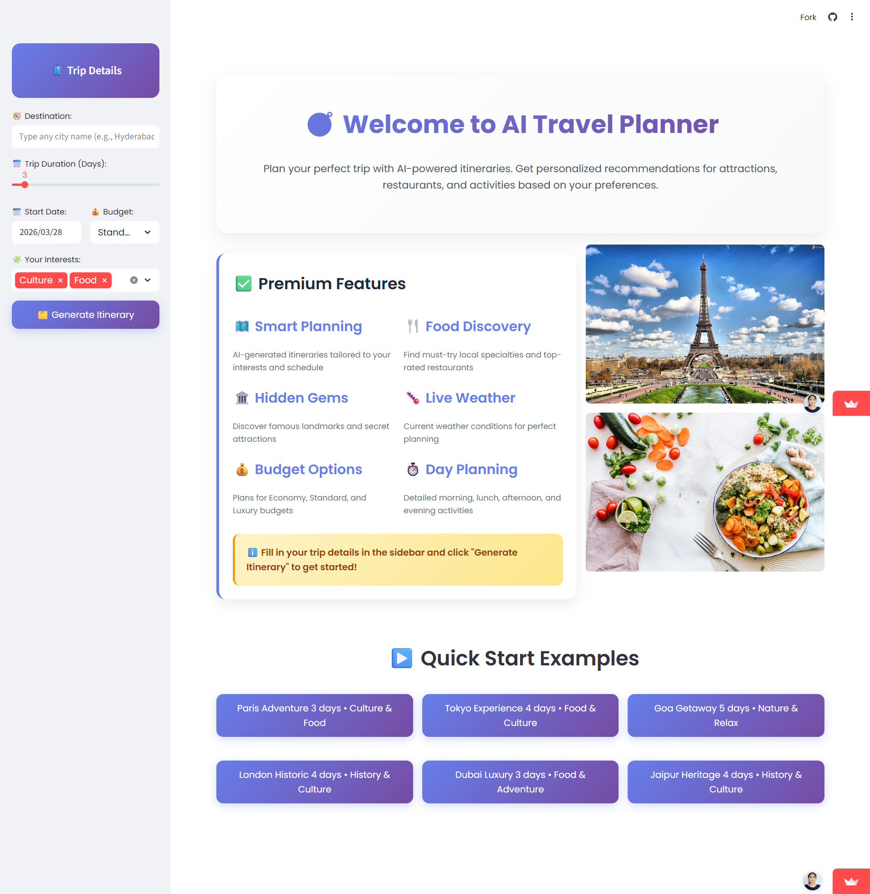
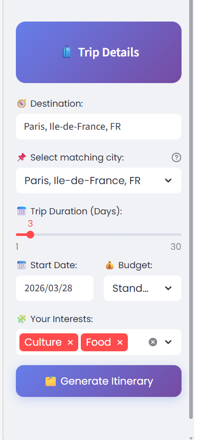

# 🌍 AI-Powered Travel Planner  
### ✨ Smart. Dynamic. Personalized Travel Experiences

> 🚀 Plan smarter trips with AI-powered real-time recommendations


---

## 🚀 Live Demo

🌐 **Frontend:** https://ai-travel-itinerary-planner-2zwwz5jfw4var5jxb8buud.streamlit.app/  
⚙️ **Backend API:** https://ai-travel-itinerary-planner-dn9y.onrender.com  

---

## 💡 What Makes This Different?

Unlike traditional itinerary planners, this system:

✔ Generates **dynamic, day-wise travel plans**  
✔ Uses **real-time APIs (weather, places, food)**  
✔ Fetches **context-aware images (no static placeholders)**  
✔ Adapts recommendations based on **user interests & budget**  
✔ Follows **production-level architecture (Frontend + Backend separation)**  

---

## 🧠 Core Features

- 🗺️ Intelligent city search & selection  
- 📅 AI-based daily itinerary generation  
- 🌦️ Live weather insights for better planning  
- 🍽️ Smart restaurant & cuisine recommendations  
- 📍 Attractions, landmarks & hidden gems  
- 🎯 Personalized suggestions based on:
  - Budget (Economy / Standard / Luxury)
  - Interests (Food, Culture, Nature, Adventure, etc.)
- 🖼️ Dynamic image rendering based on real locations  
- ⚡ Clean, responsive, and modern UI  

---

## 🔄 Data Flow

User → Frontend (Streamlit) → Backend (Flask API) → External APIs → Backend → Frontend → User  

---

## 🏗️ System Architecture

### 🎨 Frontend (Streamlit)
- Handles UI, inputs, and visualization  
- Communicates with backend via REST APIs  
- Designed for interactive user experience  

### ⚙️ Backend (Flask API)
- RESTful service architecture  
- Handles:
  - City search  
  - Weather data  
  - Places & restaurants  
  - Itinerary generation logic  
- Integrates multiple external APIs  
- Deployed as a scalable cloud service  

---

## 🧰 Tech Stack

### 💻 Frontend
- Streamlit  
- Python  
- Custom UI styling  

### 🔧 Backend
- Flask  
- Flask-CORS  
- Requests  

### 🌐 External APIs
- OpenWeather API → Weather data  
- Geoapify API → Places & attractions  
- Spoonacular API → Food recommendations  
- Wikipedia API → Landmark images  

### ☁️ Deployment
- Render → Backend  
- Streamlit Cloud → Frontend  

---

## 🚀 Deployment Details

- Frontend deployed on **Streamlit Cloud**  
- Backend deployed on **Render**  
- Continuous deployment via **GitHub integration**  

---

## 📁 Project Structure
```bash
AI-Travel-Itinerary-Planner/
│── backend/
│ └── travel_itinerary1.py
│
│── frontend/
│ └── travel_frontend.py
│
│── requirements.txt
│── .gitignore
│── README.md
```
---

## ⚙️ How It Works

1️⃣ User enters destination, duration, and preferences  
2️⃣ Frontend sends request to backend API  
3️⃣ Backend:
- Resolves location  
- Fetches weather data  
- Retrieves places & restaurants  
- Generates structured itinerary  
4️⃣ Frontend renders a clean, visual travel plan  

---

## 🔐 Security & Best Practices

- API keys stored securely using environment variables  
- `.env` excluded via `.gitignore`  
- No hardcoded credentials  
- Follows clean code and modular design  

---

## 🧪 Run Locally

### 1️⃣ Install dependencies
```bash
pip install -r requirements.txt
```

### 2️⃣ Run Backend
```bash
python backend/travel_itinerary1.py
```

### 3️⃣ Run Frontend
```bash
streamlit run frontend/travel_frontend.py
```
---

---

## 📸 Screenshots

### 🏠 Home Page


### 🧾 Input Section


### 🗺️ Generated Itinerary

## 🎯 Key Highlights

- Real-time API integration  
- Dynamic image generation (no static data)  
- Full-stack architecture (Frontend + Backend)  
- Clean, scalable project structure  

---

## 🚀 Future Scope

- ✈️ Flight & hotel integration  
- 📄 Download itinerary as PDF  
- 🗺️ Interactive maps  
- 👤 User authentication system  
- 🌍 Multi-language support  

---

## 👩‍💻 About Me

**Kagithala Varshitha**  
💻 AI | Full Stack | Web Development  
🔗 LinkedIn: https://www.linkedin.com/in/varshitha-kagithala  
📧 Email: varshithakagithala@gmail.com  

---

⭐ If you like this project, consider giving it a star!

---

